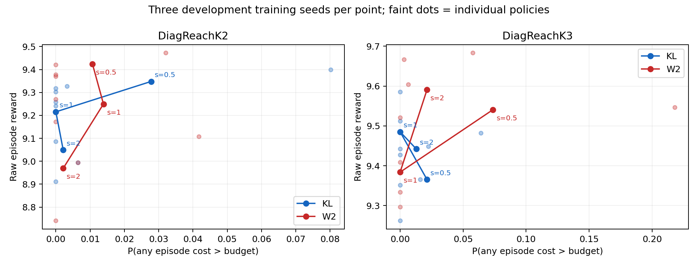

# T-1590 Joint metric solver: KL versus conditional Gaussian W2²

12 smoke +36 development completed and verified.432000 actual development training interactions;11232 separate final rawdet evaluation episodes. Route: HOLD_NO_EXPANSION. Three training seeds exploratory, not312×3 training replications.

## Completed development curve
| Task | Metric | s | Raw reward | Success | Joint | Any-channel event | Worst seed joint |
|---|---|---:|---:|---:|---:|---:|---:|
| DiagReachK2 | KL | 0.5 | 9.347819 | 1.000000 | 0.972222 | 0.027778 | 0.919872 |
| DiagReachK2 | KL | 1 | 9.215463 | 1.000000 | 1.000000 | 0.000000 | 1.000000 |
| DiagReachK2 | KL | 2 | 9.049368 | 1.000000 | 0.997863 | 0.002137 | 0.993590 |
| DiagReachK2 | W2 | 0.5 | 9.423674 | 1.000000 | 0.989316 | 0.010684 | 0.967949 |
| DiagReachK2 | W2 | 1 | 9.249502 | 1.000000 | 0.986111 | 0.013889 | 0.958333 |
| DiagReachK2 | W2 | 2 | 8.969140 | 1.000000 | 0.997863 | 0.002137 | 0.993590 |
| DiagReachK3 | KL | 0.5 | 9.365301 | 1.000000 | 0.978632 | 0.021368 | 0.935897 |
| DiagReachK3 | KL | 1 | 9.485178 | 1.000000 | 1.000000 | 0.000000 | 1.000000 |
| DiagReachK3 | KL | 2 | 9.442217 | 1.000000 | 0.987179 | 0.012821 | 0.977564 |
| DiagReachK3 | W2 | 0.5 | 9.540794 | 1.000000 | 0.926282 | 0.073718 | 0.782051 |
| DiagReachK3 | W2 | 1 | 9.383932 | 1.000000 | 1.000000 | 0.000000 | 1.000000 |
| DiagReachK3 | W2 | 2 | 9.591059 | 1.000000 | 0.978632 | 0.021368 | 0.942308 |

curves.csv/PNG/SVG report actual any-channel event probability, not1−joint. Faint dots are individual training-seed policies. Seed standard deviations are saved in CSV, not interpreted as confidence guarantees.

## Paired seed differences W2−KL
DiagReachK2 s=0.5: reward [-0.020557, 0.093144, 0.154976], joint [0.080128, 0.003205, -0.032051], any-event [-0.080128, -0.003205, 0.032051].
DiagReachK2 s=1.0: reward [0.011976, -0.194387, 0.284528], joint [0.0, -0.041667, 0.0], any-event [0.0, 0.041667, 0.0].
DiagReachK2 s=2.0: reward [-0.069353, -0.17133, 0.0], joint [0.0, 0.0, 0.0], any-event [0.0, 0.0, 0.0].
DiagReachK3 s=0.5: reward [0.057403, 0.064614, 0.404459], joint [0.0, -0.153846, -0.003205], any-event [0.0, 0.153846, 0.003205].
DiagReachK3 s=1.0: reward [-0.065218, -0.108369, -0.130149], joint [0.0, 0.0, 0.0], any-event [0.0, 0.0, 0.0].
DiagReachK3 s=2.0: reward [0.238289, 0.234517, -0.026282], joint [0.009615, -0.035256, 0.0], any-event [-0.009615, 0.035256, 0.0].

## Prewritten exploratory criterion
{
  "DiagReachK2": {
    "0.5": {
      "W2_observed_safe": false,
      "best_safe_KL_scale": 1.0,
      "best_safe_KL_reward": 9.215463222182082,
      "reward_delta_safe_KL": 0.2082103519731291,
      "margin_pass": true,
      "endpoint_reward": 9.365684263774233,
      "endpoint_pass": true,
      "delta_KL_s1": 0.2082103519731291,
      "delta_Fisher": 0.5989530380335886,
      "delta_PPOLag": 0.057989310380978765
    },
    "1.0": {
      "W2_observed_safe": false,
      "best_safe_KL_scale": 1.0,
      "best_safe_KL_reward": 9.215463222182082,
      "reward_delta_safe_KL": 0.03403868722603676,
      "margin_pass": false,
      "endpoint_reward": 9.365684263774233,
      "endpoint_pass": false,
      "delta_KL_s1": 0.03403868722603676,
      "delta_Fisher": 0.42478137328649623,
      "delta_PPOLag": -0.11618235436611357
    },
    "2.0": {
      "W2_observed_safe": false,
      "best_safe_KL_scale": 1.0,
      "best_safe_KL_reward": 9.215463222182082,
      "reward_delta_safe_KL": -0.24632315828650775,
      "margin_pass": false,
      "endpoint_reward": 9.365684263774233,
      "endpoint_pass": false,
      "delta_KL_s1": -0.24632315828650775,
      "delta_Fisher": 0.14441952777395173,
      "delta_PPOLag": -0.3965441998786581
    }
  },
  "DiagReachK3": {
    "0.5": {
      "W2_observed_safe": false,
      "best_safe_KL_scale": 1.0,
      "best_safe_KL_reward": 9.485177616287011,
      "reward_delta_safe_KL": 0.055615953909331495,
      "margin_pass": true,
      "endpoint_reward": 9.229854725290531,
      "endpoint_pass": true,
      "delta_KL_s1": 0.055615953909331495,
      "delta_Fisher": 0.31093884490581125,
      "delta_PPOLag": -0.23241682190889534
    },
    "1.0": {
      "W2_observed_safe": true,
      "best_safe_KL_scale": 1.0,
      "best_safe_KL_reward": 9.485177616287011,
      "reward_delta_safe_KL": -0.10124536404843809,
      "margin_pass": false,
      "endpoint_reward": 9.229854725290531,
      "endpoint_pass": true,
      "delta_KL_s1": -0.10124536404843809,
      "delta_Fisher": 0.15407752694804167,
      "delta_PPOLag": -0.38927813986666493
    },
    "2.0": {
      "W2_observed_safe": false,
      "best_safe_KL_scale": 1.0,
      "best_safe_KL_reward": 9.485177616287011,
      "reward_delta_safe_KL": 0.10588114789874403,
      "margin_pass": true,
      "endpoint_reward": 9.229854725290531,
      "endpoint_pass": true,
      "delta_KL_s1": 0.10588114789874403,
      "delta_Fisher": 0.3612040388952238,
      "delta_PPOLag": -0.1821516279194828
    }
  }
}
Common passing scales: []. No safe KL point would be marked missing comparator rather than W2 win. Old T1589 HOLD is unchanged. No expansion on failure, no posthoc radius search; even a pass only motivates fresh-seed confirmation.

## Numerical and replay gates
Gaussian formula/autograd-double-finite-difference gate and isotropic negative control pass; anisotropic supplied fixture reproduced. Six old firstbatch anchors nondegenerate; all36 offline metric-scale cases saved with zero environment interactions. Two offline plumbing errors (Tensor copy API, duplicate metadata keys) retained with exit1 receipts; no objective/radius edits based on evaluations.
KL_s1 exactly reproduces all six T1589 B_excess runs: all batches, old/PPO/joint/main actors, critics and moments, sampled training trajectories, choices and312 final raw episodes. Smoke first shadows/anchor/calibration/bases agree across paired metrics/scales.900 cycles/1800 distances recomputed; same KL-Fisher D and restored RNG verified. Frozen source hashes unchanged.

## What was changed
Only distance constraint in common finite-horizon reward/cost surrogate: KL(old||new) versus W2²/cW. Reward/cost likelihood ratio, Fisher-preconditioned D, original CG/damping, SLSQP/slack recovery, critic/main dual and outer excess policy are fixed. cW anchored once using training-only KL.01 solution; raw radii and both distances saved. Extra numerical solves have zero environment steps and separate time/iterations.
Eachrun6000exploration+3600selection+2400acceptance=12000;final312eval separate. Candidate pool old/joint/fullPPO, beta0. Both KL/W2 computed in everyarm, only assigned metric eligible. Invalid joint candidate excluded. Joint installs full actor with reset Adam; PPO installs own moments; noop/reject restores actor/moments. Main critic follows PPO only.

## Scope and prior art
This neural likelihood-ratio solver is nonconvex and restricted to a finite Fisher gradient subspace, not full-space/global optimality. Inner Gaussian expected-cost surrogate and outer deterministic finite-sample excess concern distinct risks. Observed zero events is not population safety. Gaussian W2 and OT trust regions are established prior art; see design.md for Computational Optimal Transport, OT-TRPO, Differentiable Trust Region Layers and WPO/SPO. No new unified SafeOT/VLA/SOTA claim.

## Artifacts
results.csv/findings.json retain each seed, costs/events/excess/success, training risks, selections/installs and timing; contrasts.csv preserves paired differences. distance_audit.json has activation, candidate differences,raw/normalized distances and calibration. jobs/ contains complete checkpoints/optimizers/commands/PIDs/exit receipts/episode traces. protocol and controller manifest are frozen. Old baseline rows reused explicitly as context in findings, original budgets/target/shaping5 and officialdet unchanged.

## Solver influence diagnostics
| Task | Metric/s | Active distance /75 | Invalid middle /75 | KL/W2 differ /75 | Selected middle | Installed middle |
|---|---|---:|---:|---:|---:|---:|
| DiagReachK2 | KL_0.5 | 75 | 0 | 75 | 17 | 14 |
| DiagReachK2 | KL_1.0 | 75 | 0 | 75 | 14 | 12 |
| DiagReachK2 | KL_2.0 | 73 | 0 | 73 | 7 | 6 |
| DiagReachK2 | W2_0.5 | 75 | 0 | 75 | 14 | 9 |
| DiagReachK2 | W2_1.0 | 75 | 0 | 75 | 15 | 12 |
| DiagReachK2 | W2_2.0 | 74 | 0 | 74 | 7 | 6 |
| DiagReachK3 | KL_0.5 | 75 | 0 | 75 | 13 | 9 |
| DiagReachK3 | KL_1.0 | 75 | 0 | 75 | 12 | 6 |
| DiagReachK3 | KL_2.0 | 75 | 0 | 75 | 9 | 7 |
| DiagReachK3 | W2_0.5 | 73 | 0 | 74 | 20 | 14 |
| DiagReachK3 | W2_1.0 | 75 | 0 | 75 | 17 | 11 |
| DiagReachK3 | W2_2.0 | 75 | 0 | 75 | 12 | 10 |

## Decision and next branch
The selected-metric trust region was active in 895/900 cycles; same-batch KL/W2 candidates differed in 896/900 cycles. Thus W2 actually changed the constrained numerical update; these negative development results are not explained by an inactive or renamed regularizer. K2 has no W2 scale with all three seeds event-free/joint1. K3 W2_s1 is observed-safe but loses0.101245 mean reward against KL_s1; its three paired reward differences are all negative. Both tasks have observed-safe KL_s1 comparators. No common W2 scale passes, so HOLD and no new-seed or radius expansion.
This does not refute all OT approaches. Next bounded research branch suggested, not started: diagnose the saved inner Gaussian risk-surrogate versus outer det-screen mismatch for selected candidates, holding the accepted KL_s1 control fixed. constraint_audit.json exposes those different-kernel residuals without claiming an unbiased prediction error or causal root. It would require a new protocol before additional training.
Legacy worker alpha=.5 labels the middle slot and moment-reset rule; it does not halve the joint candidate. The full saved joint actor is installed exactly. All1800 actual float32 cost-surrogate hard and recovery-adjusted residuals are separately saved; slack recovery is never equated with satisfying the original hard budgets. Neural derivative finite differences on all six stored batches also pass.

## Per-channel costs and risks
| Task | Metric/s | Mean episode cost | Channel event probability | Mean normalized positive excess |
|---|---|---|---|---|
| DiagReachK2 | KL_0.5 | [5.704952, 5.509903] | [0.002137, 0.025641] | [1e-05, 0.000226] |
| DiagReachK2 | KL_1.0 | [5.281164, 5.483342] | [0.0, 0.0] | [0.0, 0.0] |
| DiagReachK2 | KL_2.0 | [5.135651, 5.443087] | [0.002137, 0.0] | [2e-05, 0.0] |
| DiagReachK2 | W2_0.5 | [5.684697, 5.635855] | [0.010684, 0.0] | [0.000113, 0.0] |
| DiagReachK2 | W2_1.0 | [5.419058, 5.623175] | [0.0, 0.013889] | [0.0, 3.5e-05] |
| DiagReachK2 | W2_2.0 | [4.869442, 5.363459] | [0.002137, 0.0] | [2e-05, 0.0] |
| DiagReachK3 | KL_0.5 | [6.081012, 5.767579, 10.752484] | [0.021368, 0.0, 0.0] | [0.000137, 0.0, 0.0] |
| DiagReachK3 | KL_1.0 | [6.398155, 6.020819, 11.316251] | [0.0, 0.0, 0.0] | [0.0, 0.0, 0.0] |
| DiagReachK3 | KL_2.0 | [6.686602, 5.924106, 11.518071] | [0.007479, 0.005342, 0.0] | [4.3e-05, 2.3e-05, 0.0] |
| DiagReachK3 | W2_0.5 | [6.629732, 6.057289, 11.63832] | [0.016026, 0.063034, 0.003205] | [8e-05, 0.000366, 1.2e-05] |
| DiagReachK3 | W2_1.0 | [6.017932, 5.812024, 10.793813] | [0.0, 0.0, 0.0] | [0.0, 0.0, 0.0] |
| DiagReachK3 | W2_2.0 | [6.64074, 6.026161, 11.591099] | [0.019231, 0.002137, 0.0] | [0.000115, 9e-06, 0.0] |

[Design and primary-source references](sotd_joint_metric_T1590_design.md). Offline derivative fixtures are correctness checks, not environment results.
